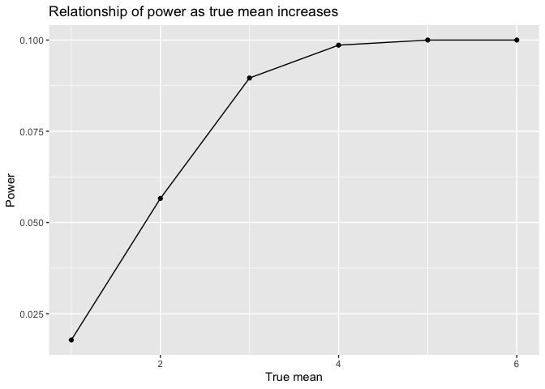
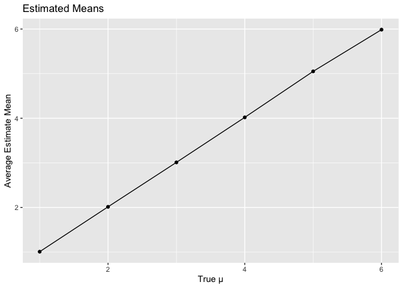

p8105_hw5_lvr2115
================
Laura Robles-Torres
2023-11-13

## Problem 2

Import and tidy data

This spaghetti plot shows observations on each subject in the control
and the experimental group over time. This plot shows that the
experimental group’s observed values increased as the study progressed
from week 1 to week 8, showing a positive association between observed
value and time. The control group’s observed values range do not show
this trend. The control group’s observed values on week 8 are all lower
than the experimental group’s observed values on the same week.

    ## `geom_smooth()` using method = 'loess' and formula = 'y ~ x'

<!-- -->

## Problem 3

Testing 5000 samples with mean = 0

Simulation: mu {1 thru 6}

    ## [1] 3000    4

    ## # A tibble: 6 × 4
    ##   mean_size iteration estimate p.value
    ##       <int>     <int>    <dbl>   <dbl>
    ## 1         1         1    2.01   0.0638
    ## 2         1         2    0.888  0.359 
    ## 3         1         3    1.61   0.0319
    ## 4         1         4    1.99   0.0231
    ## 5         1         5    0.626  0.514 
    ## 6         1         6    1.83   0.0764

# Power plot

This plot shows the proportion of times the null was rejected (the power
of the test) on the y-axis and the true value of μ on the x axis.

We can see that the proportion of rejected increases as true mean
increases. Therefore, power is increasing as effect size increases and
flattens out as it approaches 1.

<!-- -->

This plot shows the average estimate of μ on the y-axis and the true
value of μ on the x-axis.

<!-- -->

This plot shows the average estimate of μ *only in samples for which the
null was rejected* on the y-axis and the true value of μ on the x-axis.
<!-- -->

The sample average of mu across tests for which the null is rejected is
approximately equal to the true value of mu when true mu equals 4, 5 and
6. However, when mu equals 1,2,3 , sample average and true mu are
visibly not equal.
