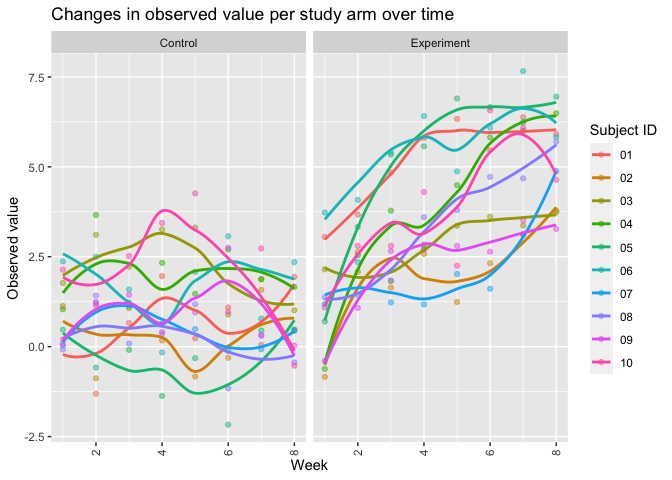

p8105_hw5_lvr2115
================
Laura Robles-Torres
2023-11-13

## Problem 2

Import and tidy data

Make a spaghetti plot showing observations on each subject over time,
and comment on differences between groups.

    ## `geom_smooth()` using method = 'loess' and formula = 'y ~ x'

<!-- -->
